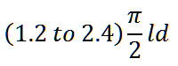
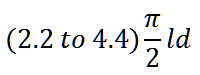
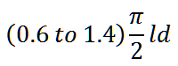
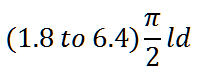
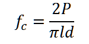
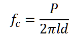
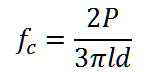
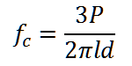

# Post Test
Q1. What is the correct loading rate from the following in N/min? 

**A      ** 

B      

C      

D       

Q2. The split tensile strength of the cylindrical concrete specimen is given by? 

**A      ** 

B      

C      

D       

Q3. What is the orientation of failure plane in split tensile test assuming that the compressive load on the specimen is applied vertically? 

A    Horizontal 

**B    Vertical** 

C    20' from Vertical 

D    45' from Vertical  
