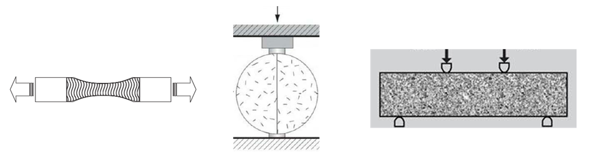
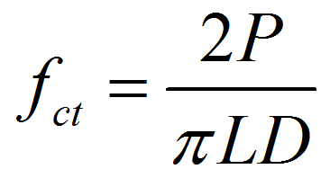
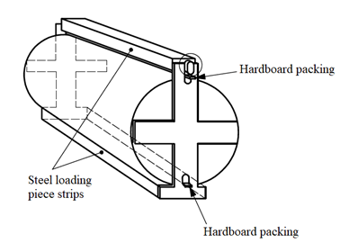

In normal structural design of members in flexure, the tensile strength of concrete is ignored. However, it is important to estimate the cracking load. The absence of cracking is important in maintaining the continuity of a concrete structure for diminishing the corrosion of reinforcement, the liquid retaining structures, for aesthetics, etc. Restrained shrinkage and temperature gradients also introduce tensile stresses. In roads, pavements and airport runways flexural tension must be resisted since steel reinforcement is absent in such pavements. Tensile strength of plain concrete can be determined by the following methods: 
 
Figure. Determination of tensile strength of plain concrete using a) Direct tension test, b) Split cylinder tension test, and c) Flexural tension test 
1. Direct tension test: In this test, a briquette made of plain concrete is pulled uniaxially and the fracture load per unit area of the specimen at fracture plane gives the tensile strength of concrete. 
The ratio of direct tension strength to uniaxial compressive strength varies from 0.07 to 0.11. This ratio decreases with increase in compressive strength. The direct tension test is not common due to the scatter of the data obtained from it and difficulty in making suitable fixtures. Accidental eccentricity in the direct tension strength test results in lower apparent tension strength, in comparison with the other tests.  
2. Split cylinder tension test: In this test, a standard cylinder of concrete specimen is placed horizontally between the loading surfaces of CTM. The compression load is applied along diametrically opposite lines, that is, along the generatrix of the cylinder until failure along the vertical plane. To allow for the uniform distribution of this applied load and to reduce the magnitude of the high compressive stresses near the point of application of this load, a strip of plywood is placed between the specimen and loading platens of the testing machine. Concrete cylinder split into two halves along the vertical plane due to indirect tensile stress generated by poisons effect. Assuming concrete specimen behaves as an elastic body, a uniform lateral tensile stress acting along the vertical plane can be calculated from the following formula: 
 
where fct is the split tensile strength, P is the compressive load at failure, L is the length of the cylinder, and D is the diameter of the cylinder. The splitting cylinder test gives values about 1.05-1.15 times those obtained from direct tension test.  
3. Flexural tension test: In this test, a standard plain concrete beam is subjected to two-point loading (also called four-point loading or third point loading). Equal loads are applied at the distance of one third from both of the beam supports. With this configuration the middle one-third portion is subjected to pure bending. No shear force is induced within this portion. As loading increased, if fracture occur within in the middle third of the beam, the maximum tensile stress reached in the extreme tension fiber is called the “modulus of rupture†and is calculated from the following formula: 
 
where fcr is the flexural strength or the modulus of rupture, L, B, D are the span, width and depth of the beam, respectively, and P is the failure load for two-point loading. The modulus of rupture is about 1.3-1.8 times the strength obtained from direct tension test. This is because of the following reasons:  
a) In direct tension test, entire specimen is subjected to maximum tension stress while in flexure test only the extreme finer in the constant moment zone are subjected to maximum tension stresses, everywhere else the stresses are lesser. So, probability of a weak element occurring and thus resulting in failure is comparatively high in direct tension test.  
b) In flexural test, the under stressed concrete near the neutral axis restrain the propagation of crack thus resulting in higher failure load.  
c) In flexural test it is assumed that the stress is proportional to the distance of fiber from the neutral axis. In reality, the stress distribution is parabolic. The modulus of rupture thus overestimates the tensile strength of concrete.  
Number of specimens: At least three specimens shall be tested for each age of tests.  
Testing conditions: Tests shall be made at the recognized ages of the test specimens, the most usual being 7 and 28 days.  
**Apparatus:**
| Name| Accuracy/Least count|
| ------ | ------ |
| Compression Testing Machine| Conforming to IS:14858 |
| Apparatus for splitting cylinder| 	Conforming to IS:516 |
| Cylinder moulds, 3 nos 150 X 300mm | Conforming to IS:1199 |
| Hardboard/Plywood packing | 	Length 300 mm, thickness 4 ± 1 mm, width 15 ± 2 mm |
| Ruler| 	0.2 mm |
| Weighing device |Weighing device |
 

 
Figure. Loading setup for flexural strength test